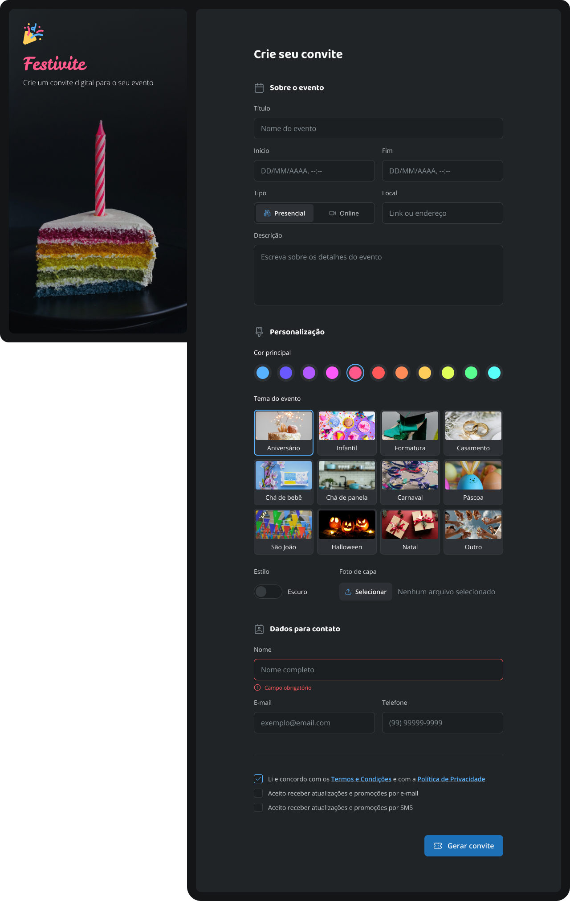

# Desafio prático - Portfólio Dev

## Sobre o Desafio

Terceiro desafio prático da formação Full-Stack pela Rocketseat. Nesse desafio 
foi proposto desenvolver um site desktop de convite para evento com formulário para geração do convite personalizado.
A partir do arquivo Figma disponibilizado, o style guide do projeto foi utilizado.

Para essa aplicação pude praticar os seguintes conceitos:

* Formulários HTML;
* Input de texto;
* Estilização de inputs com Tailwind;
* Input de data;
* Radio;
* Estilização de formulários com Tailwind;

 

